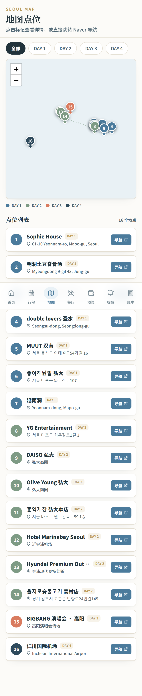
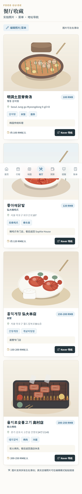
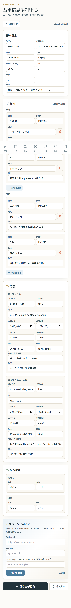
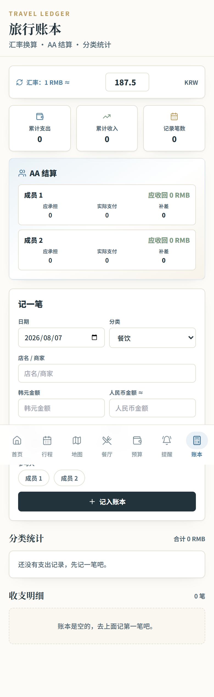

# SCREEN_MAP.md

当前网页所有页面截图与功能清单（移动端 390px 视口，2026-08-07 生成）。

## 首页

功能清单：

- 首尔旅行总览：日期、天数、人数、总预算/已消费/剩余
- 航班信息（去程/回程）
- 住宿信息（两家酒店）
- 4 日行程速览
- 云同步状态（离线/同步中/已同步/失败）
- 数据备份与同步（导出/导入）
- 编辑基础资料入口

## 行程

功能清单：

- 按天查看行程（DAY 1-4）
- 时间/地点/交通/费用/备注
- 编辑模式：排序、顺延时间、增删节点
- 在线地点搜索与手动经纬度定位
- 交通方式（公共交通/步行/打车/其他）
- 行程状态（标记完成，显示进度）
- 建议出发时间

## 地图

功能清单：

- 所有点位按天筛选
- 标记按行程顺序自动编号
- 当日路线连线
- 点位列表 + Naver 导航
- 自定义地点自动加入地图
- 可选 Naver Maps 底图（配置 Client ID 后启用）

## 餐厅

功能清单：

- 餐厅卡片：图片轮播、名称、地址、人均、推荐菜
- 编辑模式：粘贴真实照片链接、编辑菜单
- Naver 导航
- 未来图片 API 预留（imageQuery）

## 编辑中心

功能清单：

- 基本信息：旅行 ID、名称、日期、人数、总预算
- 航班编辑：去程/回程增删改
- 酒店编辑：名称、地址、入住/退房、备注、地点关联
- 旅行成员：2 人信息
- Supabase 云同步配置
- Naver Maps Client ID 配置

## 账本

功能清单：

- 汇率配置（韩元↔人民币自动换算）
- 新增/编辑/删除消费
- 支付人、参与人
- AA 结算（应承担/实际支付/补差）
- 分类统计（餐饮/购物/交通/住宿/娱乐等）
- 云同步（Supabase）
